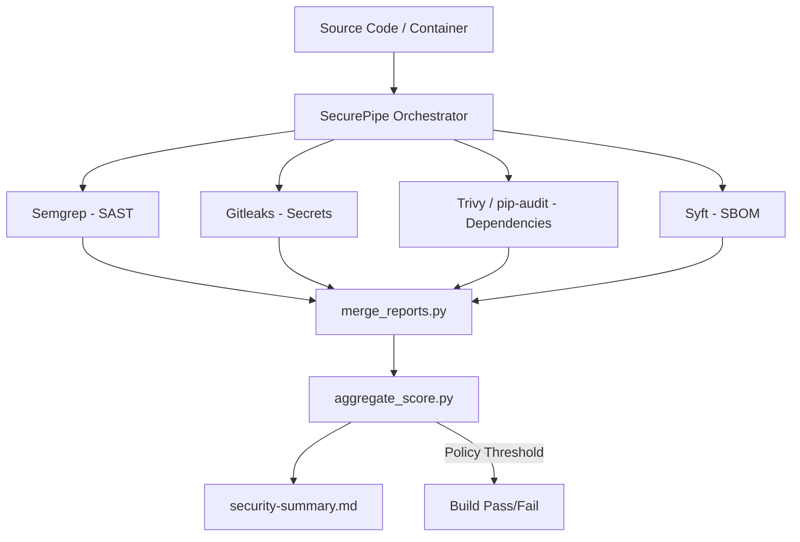

# SecurePipe — Automated Security Checks for CI/CD and Containers


---

## Overview

**SecurePipe** is a lightweight, **policy-driven DevSecOps pipeline** that automates security checks for every commit, pull request, and container build.

It unifies **static code analysis**, **dependency scanning**, **secret detection**, and **container vulnerability analysis** into one cohesive workflow — producing a single, human-readable security report.  

Think of it as an **automated security gate for your CI/CD pipeline**.

---

## Features

| Category | Tool | Purpose |
|-----------|------|---------|
| **SAST (Static Analysis)** | [Semgrep](https://semgrep.dev) | Detect insecure code patterns, injections, and crypto misuse |
| **Secrets Scanning** | [Gitleaks](https://github.com/gitleaks/gitleaks) | Catch hard-coded tokens, passwords, and API keys |
| **Dependency Scanning (SCA)** | [pip-audit](https://github.com/pypa/pip-audit) / [Trivy](https://github.com/aquasecurity/trivy) | Find vulnerable dependencies (Python & system packages) |
| **Container Scanning** | Trivy | Identify image CVEs and misconfigurations |
| **SBOM Generation** | [Syft](https://github.com/anchore/syft) | Create a Software Bill of Materials for compliance |
| **Policy Enforcement** | [OPA / Conftest](https://www.openpolicyagent.org) | Block builds on CRITICAL/HIGH findings |
| **Reporting** | Python (`merge_reports.py`, `aggregate_score.py`) | Merge results → Markdown & JSON summaries |

---

## Why It’s Special

Unlike standalone scanners, **SecurePipe** provides:

- **Unified orchestration** — all tools integrated under one CLI & CI pipeline  
- **Policy enforcement** — configurable thresholds (fail on `high` or `critical`)  
- **One consolidated report** — all findings merged into `reports/security-summary.md`  
- **Reproducibility** — deterministic setup, works on Linux, macOS, and Windows  
- **Developer-friendly DX** — one command (`make scan-all` or `bash scripts/run_all_local.sh`)  

This design mirrors enterprise “Security-as-Code” maturity: automated, repeatable, and auditable.

---

## Architecture



---

## Local Setup

### 1️⃣ Prerequisites

* **Python 3.12+**
* **Git**
* **Docker** (for container scanning)
* Optional: `make`, `bash` (for convenience)

### 2️⃣ Clone and setup

```bash
git clone git@github.com:mamun39/SecurePipe.git
cd securepipe
python -m venv .venv
source .venv/bin/activate        # on macOS/Linux
# or
.\.venv\Scripts\activate         # on Windows
pip install -U pip -r requirements.txt
```

### 3️⃣ Install external tools (choose one method)

#### On Linux/macOS:

```bash
bash scripts/install_tools.sh
```

#### On Windows:

```powershell
winget install Gitleaks.Gitleaks
winget install Semgrep.Semgrep
winget install AquaSecurity.Trivy
winget install Anchore.Syft
python -m pip install pip-audit
```

---

## Run Locally

### Option A — Makefile

```bash
make scan-all
```

### Option B — Direct scripts

```bash
bash scripts/run_all_local.sh
```

### Option C — Manual

```bash
python scanners/run_semgrep.py
python scanners/run_gitleaks.py
python scanners/run_pip_audit.py
python scanners/run_trivy.py
python scanners/run_syft.py
python utils/merge_reports.py
python utils/aggregate_score.py --fail-threshold high
```

After the run, open:

```
reports/security-summary.md
```

Example:

```markdown
# Security Summary

| Severity | Count |
|-----------|------:|
| CRITICAL  | 0 |
| HIGH      | 1 |
| MEDIUM    | 3 |
| LOW       | 2 |

**Threshold:** HIGH  
✅ Build passed — no blocking issues.
```

---

## CI/CD Integration (GitHub Actions)

This repo includes a ready-to-use workflow:
`.github/workflows/security.yml`

Triggered on every **push** or **pull request**, it:

1. Sets up Python + installs scanners
2. Runs Semgrep, Trivy, Gitleaks, Syft, pip-audit
3. Merges & aggregates results
4. Uploads the `reports/` artifacts
5. **Fails the build** on `CRITICAL` or `HIGH` vulnerabilities

### Example snippet:

```yaml
jobs:
  security:
    runs-on: ubuntu-latest
    steps:
      - uses: actions/checkout@v4
      - uses: actions/setup-python@v5
        with:
          python-version: "3.12"
      - run: |
          pip install -r requirements.txt pip-audit semgrep
          bash scripts/install_tools.sh
          make scan-all
```

---

## Reports and Artifacts

| File                          | Description                       |
| ----------------------------- | --------------------------------- |
| `reports/semgrep.sarif`       | SAST findings (static code flaws) |
| `reports/gitleaks.json`       | Secrets scan results              |
| `reports/trivy.json`          | Dependency & container CVEs       |
| `reports/sbom-spdx.json`      | Generated SBOM                    |
| `reports/merged.json`         | Unified vulnerability list        |
| `reports/security-summary.md` | Human-readable severity table     |

---

## Directory Structure

```
securepipe/
├── .github/workflows/security.yml
├── scanners/
│   ├── run_semgrep.py
│   ├── run_trivy.py
│   ├── run_gitleaks.py
│   ├── run_pip_audit.py
│   └── run_syft.py
├── utils/
│   ├── merge_reports.py
│   ├── aggregate_score.py
│   └── fmt_json.py
├── policies/
│   └── cicd.rego
├── reports/
├── scripts/
│   ├── install_tools.sh
│   └── run_all_local.sh
├── demo_app/
│   ├── app.py
│   └── requirements.txt
├── Makefile
└── README.md
```

---

## Example Use Case

Integrate SecurePipe into your team’s workflow to:

* Automatically scan every PR for vulnerabilities
* Enforce “no merge on high/critical” rules
* Generate SBOMs for compliance (ISO 27001, SOC2, etc.)
* Give developers actionable, consolidated feedback

---

## Security Policy

See [`SECURITY.md`](SECURITY.md).
All findings and disclosures should be reported via GitHub Security Advisories.

---

## Contributing

1. Fork this repo & create a feature branch.
2. Use [Conventional Commits](https://www.conventionalcommits.org).
3. Ensure no `HIGH` or `CRITICAL` findings before submitting PR.
4. Run:

   ```bash
   make scan-all
   ```

---

## License

This project is licensed under the **MIT License** — see the [LICENSE](LICENSE) file for details.

---

## Acknowledgements

* [Semgrep](https://semgrep.dev) — SAST engine
* [Gitleaks](https://github.com/gitleaks/gitleaks) — secret scanner
* [Trivy](https://github.com/aquasecurity/trivy) — vulnerability & IaC scanning
* [Syft](https://github.com/anchore/syft) — SBOM generator
* [pip-audit](https://github.com/pypa/pip-audit) — Python dependency audit
* [Open Policy Agent](https://www.openpolicyagent.org) — policy engine

---

### Future Roadmap

* [ ] Add HTML/Streamlit dashboard for visual reports
* [ ] Add CodeQL and Bandit integration
* [ ] Publish SecurePipe as a pip-installable CLI
* [ ] SBOM diffing and vulnerability trend analysis
* [ ] Slack / email notification integration

---

**SecurePipe** — Automating Security, One Pipeline at a Time


